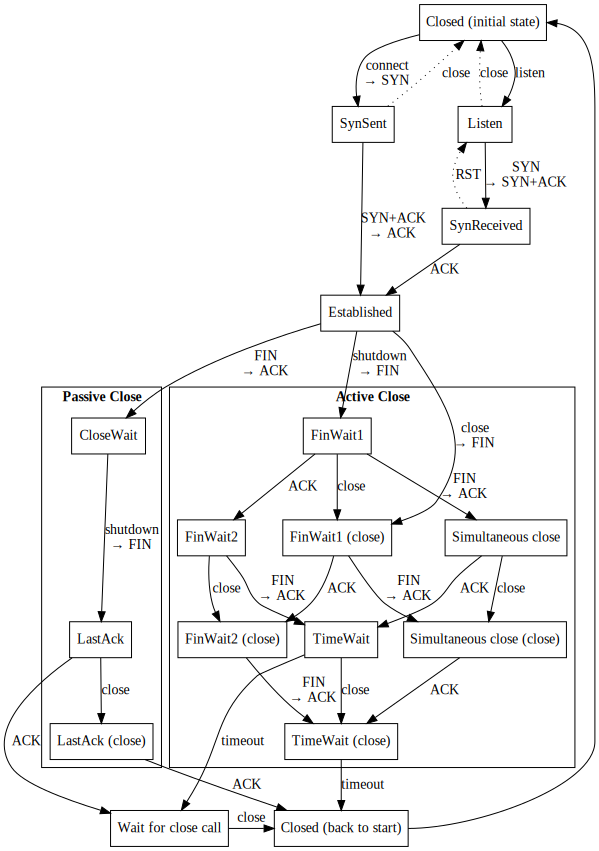

# `tcpstate` - abstract TCP socket libarary for Rust

This library provides a TCP state machine and data buffers. It is built to be integrated into a larger TCP/IP stack, and does not offer low-level functionality such as parsing TCP packets. It should be usable for BSD-style sockets.

This libary supports `#[no_std]` as long as a global alloctor is available (`alloc`). It uses flexible callback-based event handling, and avoids allocations whenever possible.

### Not yet implemented

* [critical] Sequence number wrap-around
* [critical] Lost packet retransmission
* [critical] Some state transitions
* Proper sequence number clock
* User timeouts
* Proper timers
* Buffer size limits
* Packet fragmenting
* Proper window scaling
* Nagle's Algorithm
* Congestion control and fast retransmit
* Storing out-of-order packets
* `PSH` bit support
* Selective ACKs

### Support not planned

* `URG`ent pointer support

### State transition graph

(`RST` packet handling is omitted from this graph)

## Contributions

Welcome! Remember to run `cargo fmt` before committing and make sure that tests pass with `cargo test --features std`.

## License

MIT
